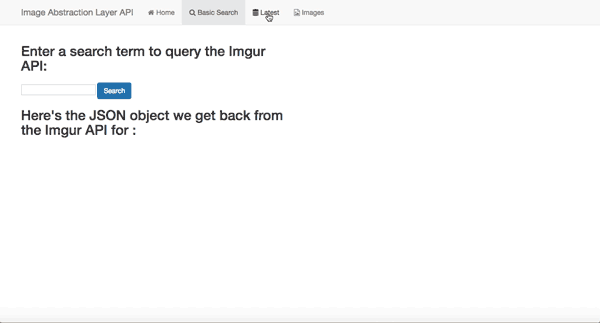

# image-search-abstraction-layer 

## Basic server-side logic, incorporating MongoDB, ES6, and a simple single-page app built with Angular.

## A user enters a string to query the Imgur API. The server returns JSON data of image URLs, alt text and page urls for a set of images relating to the given search string.

## Search results are stored in a database.

## Try it out [here](https://imgur-utility.herokuapp.com)

